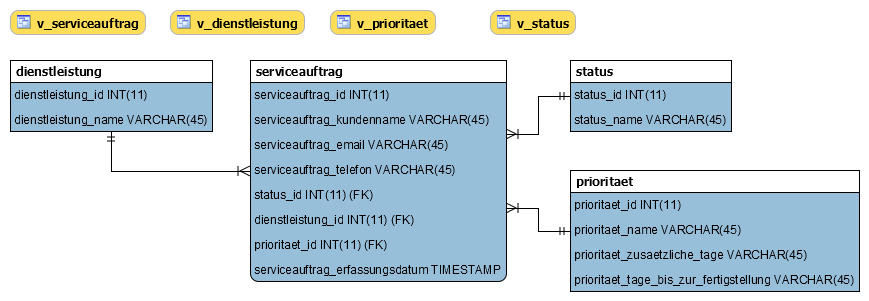

# Jetstream_DB

This is a school project. TS HF Juventus 5th semester IT, subject: database.

 [Project description PDF](Jetstream_DB/PA-SkiService.pdf)
      
# Setup

please rename the file in the folder /www from the example.ini to .ini and change you credentials accordingly
``www/.ini``
```
[database]
servername="mysql.example.ch"
dbname="dbname"
username="username"
password="MySecretPassword"
```

# Database Schema
phpMyAdmin MySQL InnoDB


### miscellaneous 
Alertbox inspired by:
https://www.cssportal.com/blog/css-notification-boxes/